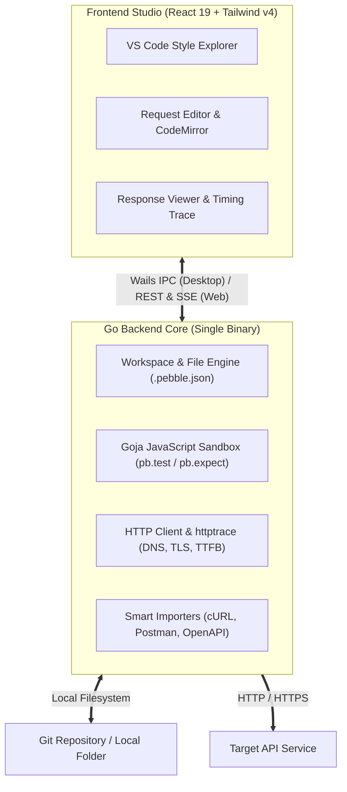

# PebblePost

A local-first, Git-friendly API client and studio for REST, GraphQL, and microservices. Built with Go 1.22+, React 19, Tailwind CSS v4, and Wails v2.

---

## Why PebblePost?

Most modern API clients have shifted toward mandatory cloud accounts, centralized collection storage, and heavy Electron runtimes. Single-file collection exports often cause painful merge conflicts in team repositories, and private secrets risk leaking into shared clouds.

PebblePost provides an alternative:
- **Local-first and Git-native**: Every request is saved as an individual `*.pebble.json` file structured within your repository folders. Teams can branch, review, and merge API changes using standard Git workflows.
- **Secret isolation**: Public environment variables are stored in `*.env.json` (tracked in Git), while private keys and tokens are stored in `*.secret.env.json` (automatically blocked by `.gitignore`).
- **Embedded JavaScript sandbox**: Pre-request transformations and response assertions (`pb.test`, `pb.expect`, `pb.environment`) run directly in pure Go via Goja, requiring no Node.js runtime.
- **Dual-runtime binary**: Runs as a lightweight native Linux desktop application via Wails v2 or as a standalone web server with an embedded React 19 interface.
- **Network timing diagnostics**: Microsecond-accurate latency breakdown for DNS Lookup, TCP Connect, TLS Handshake, TTFB, and Content Transfer.
- **Developer utilities**: 1-click code generators for cURL, Go, Node.js, Python, and C#, alongside parsers for cURL, Postman Collections (v2.1), and OpenAPI 3.0 / Swagger specs.

---

## Features

| Feature | Description |
| :--- | :--- |
| **Workspace Explorer** | Inline folder and request creation with real-time HTTP method badges and directory actions. |
| **Variable Interpolation** | Recursive `{{VARIABLE}}` resolution across URLs, query parameters, headers, and request bodies. |
| **HTTP Methods & Formats** | Full support for `GET`, `POST`, `PUT`, `DELETE`, `PATCH`, `HEAD`, `OPTIONS` with JSON, Multipart, URL-encoded, and GraphQL payloads. |
| **Automated Assertions** | Chai-compatible assertion syntax (`pb.test`, `pb.expect`) with pass/fail reports. |
| **Network Timing Breakdown** | Precise timing metrics (DNS, TCP, TLS, TTFB, Transfer) to diagnose latency bottlenecks. |
| **Code Generation** | Ready-to-use client snippets for cURL, Go `net/http`, Node.js `fetch`, Python `requests`, and C# `HttpClient`. |
| **Collection Importers** | Import requests directly from cURL commands, Postman Collection v2.1 files, or OpenAPI 3.0 schemas. |
| **CLI Test Runner** | Command-line execution (`pebblepost run`) for automated regression testing in CI/CD pipelines. |
| **Theme System** | Built-in Dark and Light themes. |

---

## Architecture



---

## Quick Start

### Standalone Web Server

Clone the repository and run the server binary:

```bash
# 1. Clone repository
git clone https://github.com/lovanbang999/pebblepost.git
cd pebblepost

# 2. Download Go dependencies
go mod download

# 3. Start server
go run ./cmd/server
```

Open **http://localhost:8080** in your browser.

---

### Native Desktop App (Linux)

Ensure Go 1.22+, Node.js 20+, and Wails v2 are installed on your system:

```bash
# Install Wails CLI if needed
go install github.com/wailsapp/wails/v2/cmd/wails@latest

# Run in live development mode
wails dev -skipbindings

# Build optimized production binary
wails build -s -skipbindings -clean
```

The compiled desktop binary will be placed at `build/bin/pebblepost`.

---

### Docker & Docker Compose

Run PebblePost containerized with persistent collection storage:

```bash
# Start container
docker compose up -d
```

Or build and run directly with Docker:

```bash
docker build -t pebblepost:latest .
docker run -d -p 8080:8080 -v $(pwd)/data:/data pebblepost:latest
```

---

## Workspace & File Specification

PebblePost organizes API collections as individual JSON files directly within your repository:

```
my-api-project/
├── .pebble/                               # Workspace configuration
│   ├── workspace.json                     # Settings & active environment
│   ├── environments/
│   │   ├── dev.env.json                   # Public variables (Git-tracked)
│   │   ├── dev.secret.env.json            # Private secrets (Auto-gitignored)
│   │   └── prod.env.json
│   └── .gitignore                         # Automatically blocks *.secret.env.json
│
└── collections/                           # API requests hierarchy
    ├── auth/
    │   ├── login.pebble.json              # Request definition file
    │   └── refresh-token.pebble.json
    └── users/
        ├── get-profile.pebble.json
        └── update-user.pebble.json
```

### Request Format (`*.pebble.json`)

```json
{
  "$schema": "https://pebblepost.dev/schemas/v1/request.json",
  "version": "1.0",
  "name": "User Login",
  "method": "POST",
  "url": "{{BASE_URL}}/api/v1/auth/login",
  "headers": [
    { "key": "Content-Type", "value": "application/json", "enabled": true }
  ],
  "params": [],
  "auth": { "type": "none" },
  "body": {
    "type": "json",
    "raw": "{\n  \"username\": \"admin\",\n  \"password\": \"{{ADMIN_PASSWORD}}\"\n}"
  },
  "scripts": {
    "preRequest": "pb.request.headers.set('X-Timestamp', Date.now().toString());",
    "postResponse": "pb.test('Status is 200', () => {\n  pb.expect(pb.response.status).to.eql(200);\n});\nconst res = pb.response.json();\nif (res?.token) {\n  pb.environment.set('AUTH_TOKEN', res.token);\n}"
  }
}
```

---

## Scripting & Test Assertions

PebblePost features a built-in ECMAScript engine powered by [Goja](https://github.com/dop251/goja):

### Pre-Request Scripts
```javascript
// Add dynamic headers or authentication signatures
const timestamp = Math.floor(Date.now() / 1000);
pb.request.headers.set('X-Request-Time', timestamp.toString());
pb.request.headers.set('X-Signature', pb.crypto.sha256('secret' + timestamp));
```

### Post-Response Tests
```javascript
// Validate status codes
pb.test("Status code is 200 OK", function() {
  pb.expect(pb.response.status).to.eql(200);
});

// Validate response duration
pb.test("Response time under 500ms", function() {
  pb.expect(pb.response.duration).to.be.below(500);
});

// Extract token to environment for subsequent requests
const data = pb.response.json();
if (data && data.access_token) {
  pb.environment.set("ACCESS_TOKEN", data.access_token);
}
```

---

## CI/CD Command Line Runner

Execute collections inside automated workflows:

```bash
# Run all requests in a collection
pebblepost run ./collections -e dev --bail

# Generate JUnit or JSON test reports
pebblepost run ./collections -e staging --report junit:results.xml
```

---

## Documentation

- [Architecture & Internals](./docs/architecture.md) - System architecture, Go engines, and frontend design
- [File & Schema Specification](./docs/specification.md) - `.pebble.json` and workspace format specifications
- [Scripting API Reference](./docs/scripting-api.md) - Reference for the `pb.*` JavaScript sandbox
- [Import & Code Generation Guide](./docs/import-export.md) - Importing from Postman, OpenAPI, and cURL

---

## Contributing

Contributions are welcome. Please read the [Contributing Guide](./CONTRIBUTING.md) and [Code of Conduct](./CODE_OF_CONDUCT.md) before submitting pull requests.

---

## Security

Please review our [Security Policy](./SECURITY.md) for vulnerability disclosure guidelines.

---

## License

PebblePost is licensed under the [MIT License](./LICENSE).
