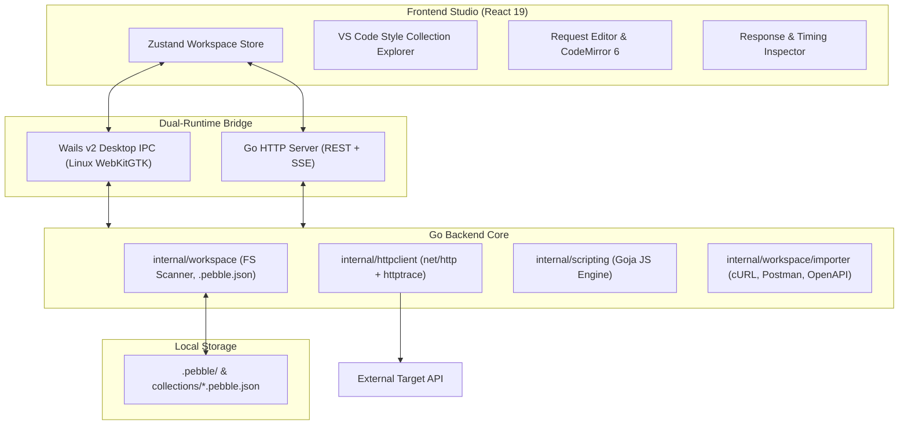
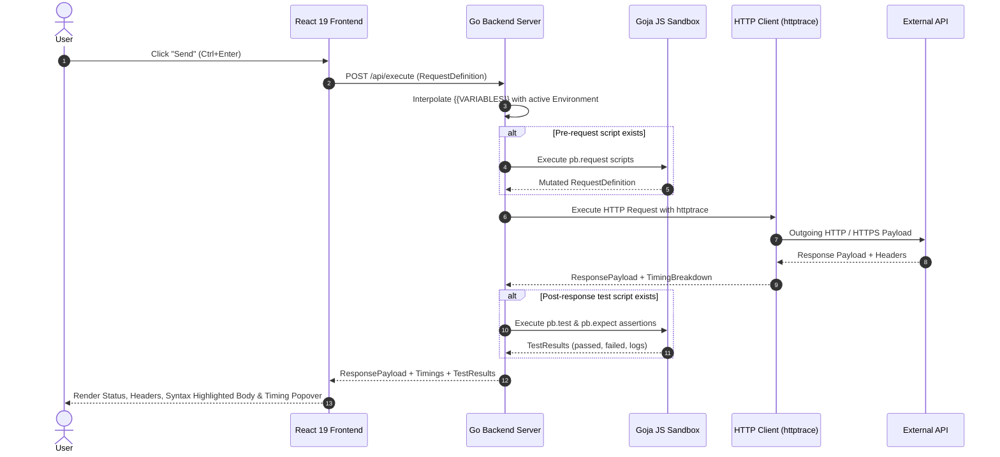

# PebblePost Architecture & Internals

> Detailed architectural design, dual-runtime model, subsystem breakdown, and request execution lifecycle.

---

## 1. System Overview

PebblePost is designed to be a high-performance, single-binary, privacy-first API client. Unlike traditional tools that rely on multi-gigabyte Electron runtimes, PebblePost utilizes a compiled Go backend coupled with a modern React 19 frontend.

---

## 2. Dual-Runtime Model

PebblePost ships as a **Single Go Binary** that can operate in two distinct modes:

### A. Native Desktop Studio (`cmd/desktop`)
- Built using **Wails v2**.
- Employs native operating system webviews (WebKitGTK on Linux) with frameless custom window decorations (`wails-drag`).
- Direct Go-to-JavaScript IPC bindings with low memory footprint (~40-80MB RAM vs 500MB+ in Electron).
- Native OS directory picker dialogs (`App.SelectDirectory`) for seamless workspace opening.

### B. Standalone Web Server (`cmd/server`)
- Compiled with Go's `go:embed` embedding the production React build (`web/dist`).
- Exposes standard REST endpoints (`/api/workspace/scan`, `/api/execute`, `/api/import`) and Server-Sent Events (SSE).
- Can run headlessly in Docker, remote servers, or developer containers.

---

## 3. Subsystem Breakdown

### `internal/workspace` (Workspace Engine)
- **Directory Scanner**: Recursively scans folders for `*.pebble.json` request files, sorting them into hierarchical collection trees matching the physical disk layout.
- **Environment Loader**: Parses `.pebble/environments/*.env.json` and automatically merges sensitive overrides from `*.secret.env.json`.
- **Variable Interpolation**: Deep regex-based substitution (`{{VAR_NAME}}`) across URLs, headers, query parameters, auth tokens, and request bodies.
- **Safety**: Automatically ensures that `.pebble/.gitignore` exists and blocks `*.secret.env.json` from accidental Git commits.

### `internal/httpclient` (Network Engine)
- Implements custom `http.Client` with dynamic connection pooling, TLS certificate validation toggles, and redirect policies.
- Integrates `net/http/httptrace` to record microsecond-precise timings:
  - **DNS Lookup**: Time to resolve domain IP address.
  - **TCP Connection**: Syn/Ack socket handshake duration.
  - **TLS Handshake**: SSL/TLS certificate negotiation duration.
  - **TTFB (Time to First Byte)**: Time waiting for the server's initial byte.
  - **Content Transfer**: Time spent downloading the response payload.

### `internal/scripting` (Goja Sandbox)
- Embeds [Goja](https://github.com/dop251/goja), a pure Go ECMAScript 5.1+ runtime.
- **Isolation**: Runs in an isolated memory context with no Node.js built-ins (`process`, `fs`, `child_process`).
- **Bridge APIs**:
  - `pb.request`: Modify outgoing headers, params, and body before execution.
  - `pb.response`: Read status, headers, body text, and JSON.
  - `pb.environment`: Get and set persistent environment variables.
  - `pb.test()` & `pb.expect()`: Chai-compatible BDD assertion syntax.
  - `pb.crypto`: Built-in hashing utilities (MD5, SHA256, HMAC, UUID).

---

## 4. Request Execution Lifecycle

